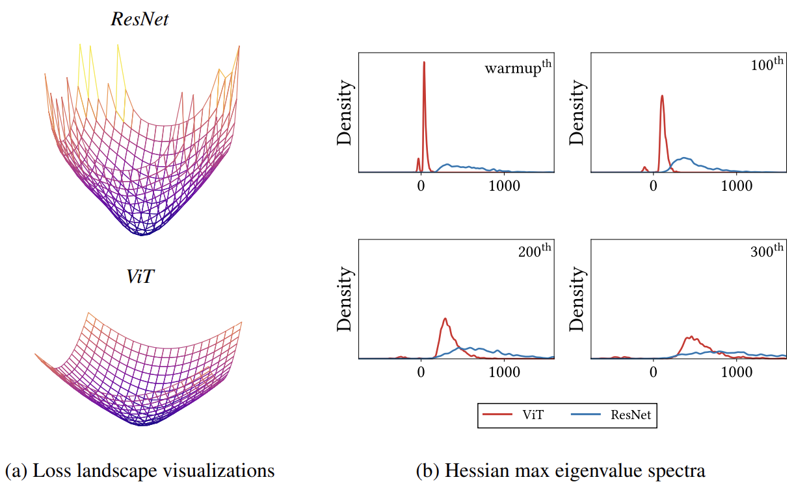
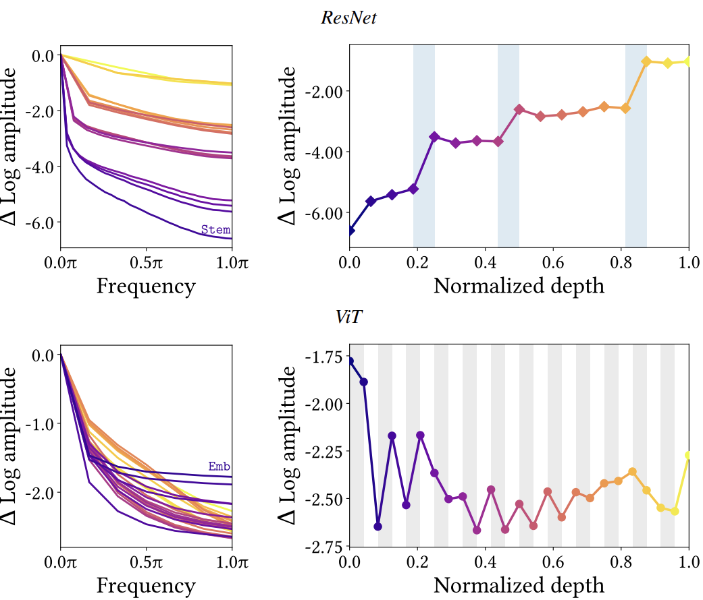
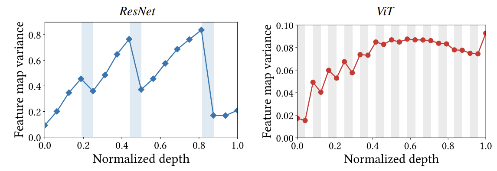
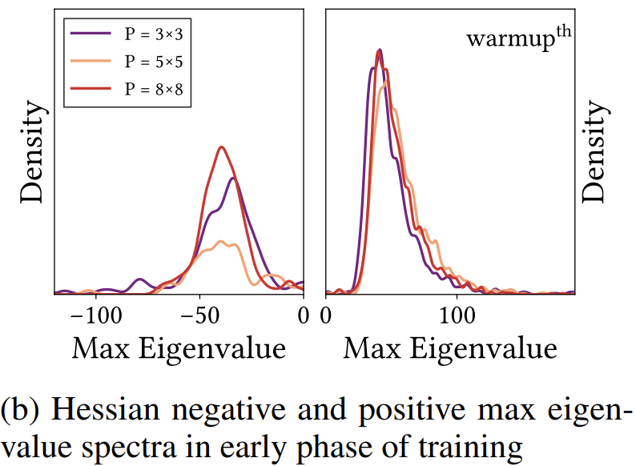
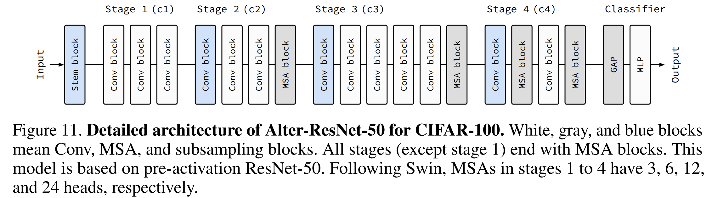

# How Do Vision Transformers Work? - Analysis
**DS 5690 Paper Presntation**

*Authors: Namuk Park & Songkuk Kim (Yonsei University, NAVER AI Lab)*  
*Published at ICLR 2022*

**Full Citation:**  
Park, N., & Kim, S. (2022). How Do Vision Transformers Work?. In International Conference on Learning Representations (ICLR 2022). arXiv:2202.06709v4 [cs.CV]
___
# Overview
**The abstract says it all**: 

"The success of multi-head self-attentions (MSAs) for computer vision is now indisputable. However, little is known about how MSAs work. We present fundamental explanations to help better understand the nature of MSAs.";

"MSAs are low-pass filters, but Convs are high-pass filters. Therefore, MSAs and Convs are complementary.";

"We propose AlterNet, a model in which Convblocks at the end of a stage are replaced with MSA blocks."

## **Context**:
Following the success of the original Vision Transformer (ViT) introduced by [Dosovitskiy et al.](https://arxiv.org/pdf/2010.11929) in 2021, Multi-head Self-Attention (MSA) mechanisms have become ubiquitous in computer vision. By 2022, numerous variants—including [Swin Transformer](https://arxiv.org/pdf/2103.14030) and [PiT](https://arxiv.org/pdf/2103.16302) demonstrated that MSAs could match or exceed the performance of traditional Convolutional Neural Networks (CNNs) on various vision tasks. Despite this empirical success, the fundamental mechanisms explaining why MSAs work remained poorly understood. MSAs success has been attributed to "weak inductive bias" and "long-range dependency"—the ability to connect distant spatial locations in an image. Attributing MSAs success to those two traits conflict with common issues with MSAs such as the tendency to overfit training datasets, consequently leading to poor predictive performance in small data regime. 

## **Problems**: 
- MSAs are generally not defined well despite its ubiquitous success.
- What are listed as strengths for MSAs conflict with their weaknesses.
     - Specifically the "weak inductive bias" strength. If this is a benefit, why would **MSAs struggle on small datasets?**
- Local MSAs (small window MSAs) achieve better performance than global MSAs on small and large datasets.

## **Approach**:

This paper has three analytical approaches to addressing these problems. Most of which it will compare ViTs to [ResNeT](https://www.cv-foundation.org/openaccess/content_cvpr_2016/papers/He_Deep_Residual_Learning_CVPR_2016_paper.pdf)-A CNN image model
- **Loss Landscape Map Analysis**
       
     - Looking at the Hessian (Second partial derivative) eigenvalues (how a matrix transforms space) of the loss landscape to measure local curvature and convexity.
     - Visualize loss landscapes using [filter normalization](https://arxiv.org/pdf/1712.09913) (calculated by taking the square root of the sum of the squares of all its elements)
     - Analyzes how local vs. global MSAs affect losses.
 
- **Fourier Domain Analysis**
     
  - The authors examaine the feature map in the fourier domain
  - Meaasures high vs. low frequency accuracies

- **Feature Map Statistics**
       
  - Tracks feature map variance across network layers
  - Performs lesion studies (removing individual layers) to measure importance
  - Analyzes representational similarity using [CKA](https://arxiv.org/pdf/2010.15327) (Centered Kernel Alignment)
 
## **How the problems were addressed**:
- MSAs are generally not defined well despite its ubiquitous success
  - "MSAs work by addressing themselves as a general form of spatial smoothing or an implementation of ensemble averaging for proximate data points"
    
- What are listed as strengths for MSAs conflict with their weaknesses
  - The paper redefines weak inductive bias as a **LIABILITY**, not a strength. ~ "A small patch size, or a weak inductive bias, produces negative eigenvalues" Meaning non-convex losses.
    
- Local MSAs (small window MSAs) achieve better performance than global MSAs on small and large datasets
  - 
  - Smaller MSA windows have more convex losses as shown above.
    
## **MSA Positives**:
   - Flatten lost landscapes (Due to data specificity, not long range dependency)
   - MSAs act as low pass filters
   - Play a key role in model's predictions if placed at the end of multi-stage neural networks.
   - Convolutional Neural Networks (which acts as a high pass filter) is complimentary to MSAs as shown in their model **AlterNet**

_____
# Architecture overview
## AlterNet 



# Algorithm: AlterNet-50

**Input:**  
`x ∈ ℝ^(B×3×H×W)`, image batch  
- `B`: batch size  
- `H`, `W`: image height and width (32 for CIFAR-100)

**Parameters:**  
- `stem`: initial Conv layer  
- `stage_1`: L₁ Conv blocks (no MSA)  
- `stage_2`: L₂ Conv blocks + 1 MSA block (6 heads)  
- `stage_3`: L₃ Conv blocks + 1 MSA block (12 heads)  
- `stage_4`: L₄ Conv blocks + 1 MSA block (24 heads)

**Output:**  
`ŷ ∈ ℝ^(B×100)`, class logits for CIFAR-100

**Build up Rule:**

• Replace Conv blocks with MSA blocks from the end of a baseline CNN model.

• If the added MSA block does not improve predictive performance, replace a Conv blocklocated at the end of an earlier stage with an MSA block.

• Use more heads and higher hidden dimensions for MSA blocks in late stages.


**Procedure:**

1. `z ← Stem(x)`  
   ▷ Conv 7×7, stride 2  
   ▷ Output: `B × 64 × 16 × 16`

2. `z ← Stage_1(z, L₁)`  
   ▷ L₁ Conv blocks  
   ▷ NO MSA blocks  
   ▷ Output: `B × 256 × 16 × 16`

3. `z ← Stage_2(z, L₂)`  
   ▷ L₂ Conv blocks  
   ▷ + 1 MSA block (6 heads)  
   ▷ Output: `B × 512 × 8 × 8`

4. `z ← Stage_3(z, L₃)`  
   ▷ L₃ Conv blocks  
   ▷ + 1 MSA block (12 heads)  
   ▷ Output: `B × 1024 × 4 × 4`

5. `z ← Stage_4(z, L₄)`  
   ▷ L₄ Conv blocks  
   ▷ + 1 MSA block (24 heads)  
   ▷ Output: `B × 2048 × 2 × 2`

6. `z ← GlobalAveragePooling(z)`  
   ▷ Pool to `B × 2048`

7. `ŷ ← MultilayerPerceptron(z)`  
   ▷ Linear `2048 → 100`

8. `return ŷ`


**If AlterNet ends with MSA why does it perform better on smaller datasets?**
_____
# Critical Analysis

## **What could have been developed further**:
- "If the added MSA block does not improve predictive performance, replace a Conv block located at the end of an earlier stage with an MSA block." (Build-up rule; Section 4.1)
- The above rule appears to be a rule the authors learned as they experiemented, but did not take the time to understand why architecturally this works well. They should have taken the time to find the theoretical reasoning behind this.
- My using this paper as a source, I would assume this is a rule because of the loss flattening ability of MSAs, but it is never explicitly stated in the reading.

## **How did the study stand years after?**:
- Data Specificity > Long-Range Dependency did not hold up with time

**Scaling trends contradict this**:
- Paper's argument: "Local MSAs (5×5) > Global MSAs (8×8)"
     - Therefore → Long-range dependency not important
- Reality: [ViT-22B](https://arxiv.org/pdf/2302.05442) (global attention)
     - Achieve state-of-the-art on many tasks
     - Long-range DOES matter at scale!

_____
## Impacts
- The paper reframed understading of MSAs. They would now be thought of as a generalized spatial smoothing rather than incorrectely seeing them as long-range dependency exploiters
- The Fourier analysis revealing MSAs as low-pass filters while CNNs are high-pass filters provides:
     - A mathematical characterization of architectural differences
     - Explanation for ViT frequency dependant advantages. 
     - Justification for hybrid architectures (Convs for texture/high-frequency, MSAs for shape/low-frequency)
- Shifted the Narrative from "Weak Inductive Bias" to "Complementary Mechanisms"
_____
## Code Demonstration
# Feature map variance
```python

import sys

# check whether run in Colab
root = "."
if "google.colab" in sys.modules:
    print("Running in Colab.")
    !pip3 install matplotlib
    !pip3 install einops==0.4.1
    !pip3 install timm==0.5.4
    !git clone https://github.com/xxxnell/how-do-vits-work.git
    root = "./how-do-vits-work"
    sys.path.append(root)

import yaml
import copy

import torch
from torch.utils.data import DataLoader

import models
import ops.tests as tests
import ops.datasets as datasets


# config_path = "%s/configs/cifar10_vit.yaml" % root
config_path = "%s/configs/cifar100_vit.yaml" % root
# config_path = "%s/configs/imagenet_vit.yaml" % root

with open(config_path) as f:
    args = yaml.safe_load(f)
    print(args)

dataset_args = copy.deepcopy(args).get("dataset")
train_args = copy.deepcopy(args).get("train")
val_args = copy.deepcopy(args).get("val")
model_args = copy.deepcopy(args).get("model")
optim_args = copy.deepcopy(args).get("optim")
env_args = copy.deepcopy(args).get("env")

dataset_train, dataset_test = datasets.get_dataset(**dataset_args, download=True)
dataset_name = dataset_args["name"]
num_classes = len(dataset_train.classes)

dataset_train = DataLoader(
    dataset_train, 
    shuffle=True, 
    num_workers=train_args.get("num_workers", 4), 
    batch_size=train_args.get("batch_size", 128),
)
dataset_test = DataLoader(
    dataset_test, 
    num_workers=val_args.get("num_workers", 4), 
    batch_size=val_args.get("batch_size", 32),
)

print("Train: %s, Test: %s, Classes: %s" % (
    len(dataset_train.dataset), 
    len(dataset_test.dataset), 
    num_classes
))

# download and load a pretrained model for CIFAR-100
url = "https://github.com/xxxnell/how-do-vits-work-storage/releases/download/v0.1/resnet_50_cifar100_691cc9a9e4.pth.tar"
path = "checkpoints/resnet_50_cifar100_691cc9a9e4.pth.tar"
models.download(url=url, path=path)

name = "resnet_50"
model = models.get_model(name, num_classes=num_classes,  # timm does not provide a ResNet for CIFAR
                         stem=model_args.get("stem", False))
map_location = "cuda" if torch.cuda.is_available() else "cpu"
checkpoint = torch.load(path, map_location=map_location)
model.load_state_dict(checkpoint["state_dict"])

# model → blocks. `blocks` is a sequence of blocks
blocks = [
    model.layer0,
    *model.layer1,
    *model.layer2,
    *model.layer3,
    *model.layer4,
    model.classifier,
]

import copy
import timm
import torch
import torch.nn as nn

# download and load a pretrained model for CIFAR-100
url = "https://github.com/xxxnell/how-do-vits-work-storage/releases/download/v0.1/vit_ti_cifar100_9857b21357.pth.tar"
path = "checkpoints/vit_ti_cifar100_9857b21357.pth.tar"
models.download(url=url, path=path)

model = timm.models.vision_transformer.VisionTransformer(
    num_classes=100, img_size=32, patch_size=2,  # for CIFAR
    embed_dim=192, depth=12, num_heads=3, qkv_bias=False,  # for ViT-Ti 
)
model.name = "vit_ti"
models.stats(model)
map_location = "cuda" if torch.cuda.is_available() else "cpu"
checkpoint = torch.load(path, map_location=map_location)
model.load_state_dict(checkpoint["state_dict"])


# model → blocks. `blocks` is a sequence of blocks

class PatchEmbed(nn.Module):
    def __init__(self, model):
        super().__init__()
        self.model = copy.deepcopy(model)
        
    def forward(self, x, **kwargs):
        x = self.model.patch_embed(x)
        cls_token = self.model.cls_token.expand(x.shape[0], -1, -1)
        x = torch.cat((cls_token, x), dim=1)
        x = self.model.pos_drop(x + self.model.pos_embed)
        return x
    
class Residual(nn.Module):
    def __init__(self, *fn):
        super().__init__()
        self.fn = nn.Sequential(*fn)
        
    def forward(self, x, **kwargs):
        return self.fn(x, **kwargs) + x
    
    
class Lambda(nn.Module):
    def __init__(self, fn):
        super().__init__()
        self.fn = fn
        
    def forward(self, x):
        return self.fn(x)


def flatten(xs_list):
    return [x for xs in xs_list for x in xs]


# model → blocks. `blocks` is a sequence of blocks
blocks = [
    PatchEmbed(model),
    *flatten([[Residual(b.norm1, b.attn), Residual(b.norm2, b.mlp)] 
              for b in model.blocks]),
    nn.Sequential(model.norm, Lambda(lambda x: x[:, 0]), model.head),
]

xs, ys = next(iter(dataset_test))  # only one batch is used for simplicity

# accumulate `latents` by collecting hidden states of a model
latents = []
with torch.no_grad():
    for block in blocks:
        xs = block(xs)
        latents.append(xs)
        
if model.name in ["vit_ti", "pit_ti"]:  # for ViT: Drop CLS token
    latents = [latent[:,1:] for latent in latents]
latents = latents[:-1]  # drop logit (output)

import math
from einops import rearrange, reduce, repeat


# aggregate feature map variances
variances = []
for latent in latents:  # `latents` is a list of hidden feature maps in latent spaces
    latent = latent.cpu()
    
    if len(latent.shape) == 3:  # for ViT
        b, n, c = latent.shape
        h, w = int(math.sqrt(n)), int(math.sqrt(n))
        latent = rearrange(latent, "b (h w) c -> b c h w", h=h, w=w)
    elif len(latent.shape) == 4:  # for CNN
        b, c, h, w = latent.shape
    else:
        raise Exception("shape: %s" % str(latent.shape))
                
    variances.append(latent.var(dim=[-1, -2]).mean(dim=[0, 1]))
    

# Plot Fig 9: "Feature map variance"
import numpy as np
import matplotlib.pyplot as plt

if model.name == "resnet_50":  # for ResNet-50
    pools = [4, 8, 14]
    msas = []
    marker = "D"
    color = "tab:blue"
elif model.name == "vit_ti":  # for ViT-Ti
    pools = []
    msas = [1, 3, 5, 7, 9, 11, 13, 15, 17, 19, 21, 23,]
    marker = "o"
    color = "tab:red"
else:
    import warnings
    warnings.warn("The configuration for %s are not implemented." % model.name, Warning)
    pools, msas = [], []
    marker = "s"
    color = "tab:green"

depths = range(len(variances))

# normalize
depth = len(depths) - 1
depths = (np.array(depths)) / depth
pools = (np.array(pools)) / depth
msas = (np.array(msas)) / depth


fig, ax = plt.subplots(1, 1, figsize=(6.5, 4), dpi=200)
ax.plot(depths, variances, marker=marker, color=color, markersize=7)

for pool in pools:
    ax.axvspan(pool - 1.0 / depth, pool + 0.0 / depth, color="tab:blue", alpha=0.15, lw=0)
for msa in msas:
    ax.axvspan(msa - 1.0 / depth, msa + 0.0 / depth, color="tab:gray", alpha=0.15, lw=0)
    
ax.set_xlim(left=0, right=1.0)
ax.set_ylim(bottom=0.0,)

ax.set_xlabel("Normalized depth")
ax.set_ylabel("Feature map variance")

plt.show()
# Grey is MSA
# White is Conv block

```
_____
# Citations
- **Paper:** "How Do Vision Transformers Work?" (Park & Kim, ICLR 2022)
- **Code:** https://github.com/xxxnell/how-do-vits-work
